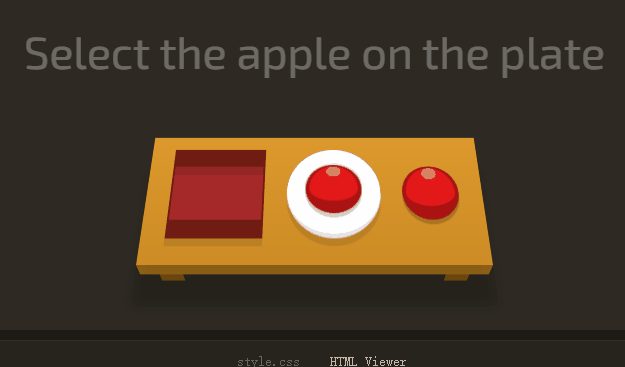

# CSS 选择器

[css dinner](https://flukeout.github.io/)

[答案](https://gist.github.com/chrisman/fcb0a88459cd98239dbe6d2d200b02d1)

## 1. 通过标签选择: bento


## 2. 通过id: #fancy

```html
<div class="table">
    <plate id="fancy" />
    <plate />
    <bento />
</div>
```


## 3. 多级标签选择: plate apple

```html
<div class="table">
    <bento />
    <plate>
        <apple />
    </plate>
    <apple />
</div>
```

找到所有plate标签中的apple标签



## 4. 多级选择: #fancy pickle

```html
<div class="table">
    <bento>
        <orange />
    </bento>
    <plate id="fancy">
        <pickle />
    </plate>
    <plate>
        <pickle />
    </plate>
</div>
```


可以借助id选择器来定位

## 5. 通过类名(class)定位: .small

```html
<div class="table">
    <apple />
    <apple class="small" />
    <plate>
        <apple class="small" />
    </plate>
    <plate />
</div>
```


## 6. 标签和class组合: orange.small


## 7. 标签 class的多级组合: bento orange.small


## 8. 逗号同时选择多个: bento, plate


## 9. 选择所有: *


## 10. 标签和*组合: plate *


## 11. 选择第一个跟随的元素: plate + apple


## 12. 选择跟在元素有后面的所有某元素: bento ~ pickle


A~B: 跟在A元素后面的所有B元素(兄弟关系)

## 13. 选择元素的直接子元素: plate > apple


> 第一个apple并不是直接子元素

## 14. 选择第一个元素: orange:first-child


注意区分有无空格:

- plate:first-child 表示选择所有的第一个plate元素,指定是plate元素
- plate :first-child 表示选择plate中的第一个元素,未指定,第一个就行

## 15. 选择唯一子元素,要求父元素中只有这一个唯一的子元素: plate: only-child


## 16. 选择最后一个元素: .small:last-child


## 17. 选择第n个元素: :nth-child(3)

> 索引从1开始


## 18. 选择倒数第n个元素: bento:nth-last-child(3)


## 19. 根据标签选择某种元素的第一个: apple:first-of-type


## 20. 特定规则选择: plate:nth-of-type(even)

> even 偶数 | odd 奇数


## 21. plate:nth-of-type(2n+3)

An+b 的次序不能改变


## 22. 选择在父类中唯一的元素: plate apple:only-of-type


## 23. 选择不同标签的最后一个元素: orange:last-of-type, apple:last-of-type


## 24. 选择空的: bento:empty


## 25. 选择不包含某种属性的: apple:not(.small)


## 26. 选择含有某种属性的: [for]


## 27. 选择属性与标签结合: plate[for]


## 28. 选择属性具有特定的值: [for='Vitaly']


## 29. 选择属性的开头值: [for^="Sa"]


## 30. 选择属性的结尾值: [for$="ato"]


## 31. 选择属性含有某些值: [for*="obb"]


